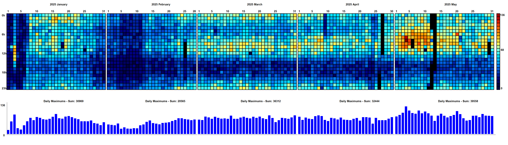
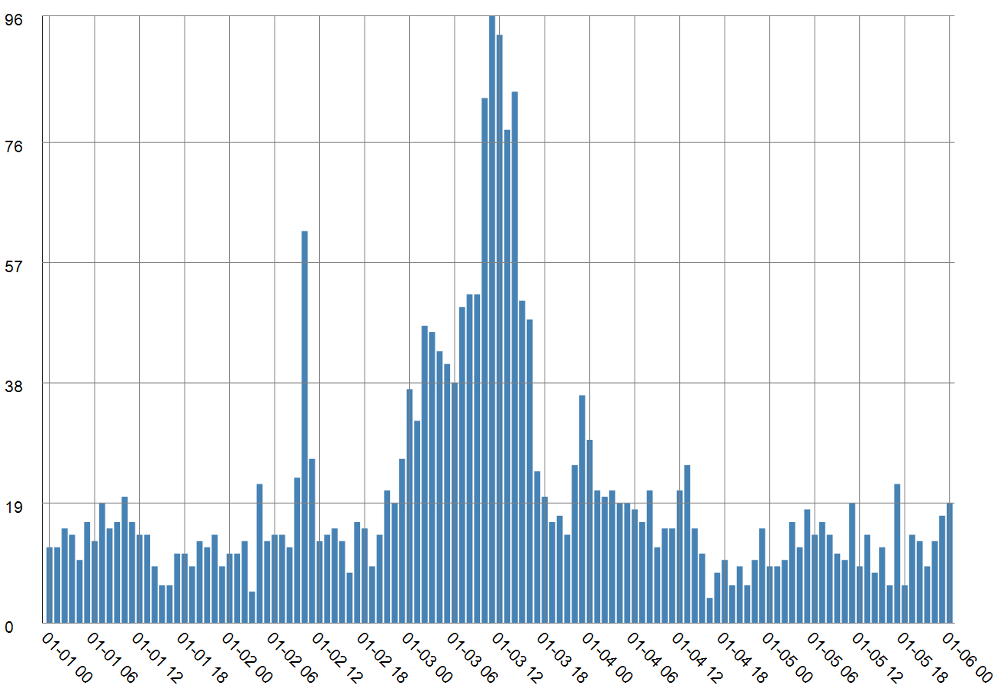
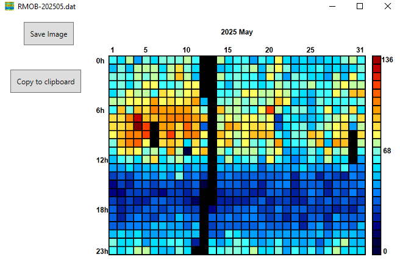

# RMOB DAT Visualizer

## Introduction

This is a small project for visualizing SpectrumLab-type `RMOB-YYYYMM.dat` files.  
**Note:** This project is still in progress!

### Example `RMOB-202408.dat` file:

```
2024080100 , 00 , 84
2024080101 , 01 , 81
2024080102 , 02 , 80
```

The file uses commas (`,`) as delimiters:  
- The **first column** contains the date and hour in the format `YYYYMMDDHH` (UTC).  
- The **second column** shows the hour.  
- The **third column** contains the meteor count for the given hour.  
Line endings must be **CRLF** (`\r\n`).

## Prerequisities
- Microsoft Windows (tested on 10)
- [.NET 6 Runtime](https://dotnet.microsoft.com/en-us/download/dotnet/6.0)  
  *(Will be upgraded to .NET 8 or 10 in the future)*
---

## Usage

1. Click the **"Open"** button to select one or more `.dat` files.  
   *(The order of the files doesn’t matter – the app will sort them automatically.)*
2. Choose the type of visualization:
   - **RMOB visualization**: Similar to [rmob.org](https://rmob.org), but with:
     - Multiple scale options
     - Daily maximum view
     - Multi-month support  
     
   - **Meteor shower view**: Displays hourly meteor counts for a short time range (e.g., a few days).  
     
3. Press the **"Generate"** button!
4. A new window will appear showing the result, or an info dialog in case of errors.  
   

   You can:
   - Save the image
   - Copy to clipboard and paste into any image editor

---

## Options

### RMOB Visualization

- **Months per row** – When multiple files are selected, choose how many months to display per row.
- **Scale** – Choose the preferred color scale.
- **Show daily maximums** – Display a bar chart underneath the main visualization.

### Meteor Shower

- **Start date** – The beginning of the diagram (00:00).
- **End date** – The end of the diagram (23:59).
- **Show grid** – Display a grid overlay on the bar chart.

---

## Other Notes

- Any issues or feature suggestions are welcome!
- The code is actively being improved – stay tuned.
- Sample files are available in the `Examples` folder.
- Check out the **Szeged Observatory livestream**:  
  [https://www.youtube.com/@szegedicsillagvizsgalo5848/live](https://www.youtube.com/@szegedicsillagvizsgalo5848/live)